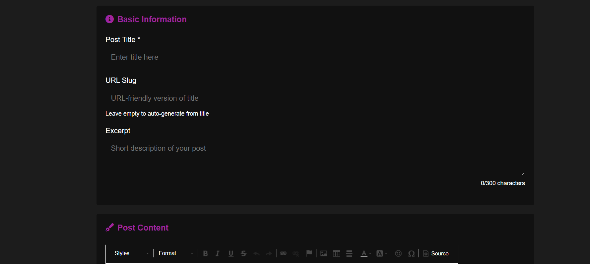

<h1 align="center">
  Skriva
</h1>

Skriva is an application that allows you to create your own blog and interact with others blogs. The app enables users to add, edit, delete, like, and discover blogs created by other users.

<h2 align="center">
Project Purpose
</h2>

The project was created primarily to learn how the Django framework works, as it handles the entire backend of this application. By building such a large project, I gained a lot of new knowledge that will be useful to me in the future.

<h2 align="center">
Features
</h2>

Creating posts, Editing posts, Deleting posts, Changing post status, View counter for each post, Ability to like posts, Profile customization (banner/profile picture/bio/date of birth/full name), Login via Discord or GitHub, Viewing posts from other users (on a dedicated page), Viewing other users' profiles (on a dedicated page), Viewing all posts from a specific user

<h2 align="center">
Live Demo
</h2>

Link: https://www.xarom.one/

<h2 align="center">
Technologies Used
</h2>

**Note:**

This application uses PostgreSQL **only in the production environment**. The development environment uses the default SQLite database.

<h2 align="center">
How to Use
</h2>

To run this application, you’ll need a basic understanding of Django *(if you want to run it on your own computer or server)*. If you just want to see how it works, visit the live demo.

**1.** Steps to run the application locally:

**2.** Clone the entire GitHub repository.

**3.** Install all dependencies from requirements.txt.

`pip install -r requirements.txt`

**4.** Fill the .env file with all the necessary information.

**5.** Run migrations:
`python manage.py makemigrations`

`python manage.py migrate`

**6.** Start the (local) server:

`python manage.py runserver`

**WARNING! If you want to deploy this project to a server, you will need to add your domain in all required places in the settings file and replace every instance of yourdomain accordingly.**

<h2 align="center">
App appearance
</h2>

<h2 align="center">
Licence
</h2>

This project is licensed under the MIT License, which means it is free to use, modify, and distribute with minimal restrictions, as long as the original license and copyright notice are included.

<h2 align="center">
Project Status
</h2>

*This application will no longer be actively developed. However, bug fixes may still be released occasionally.*

**SkriVa created by Gabriel Dudek (XaromPL)**
